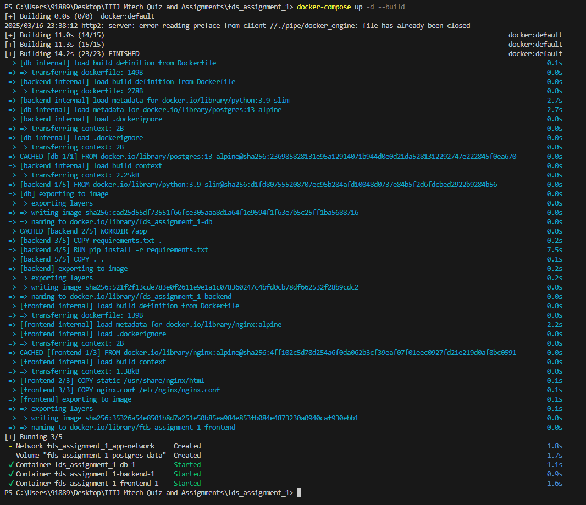
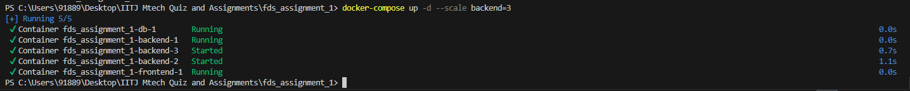
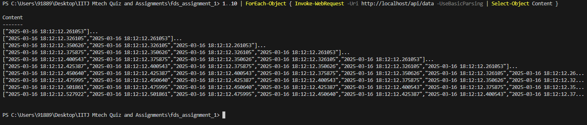
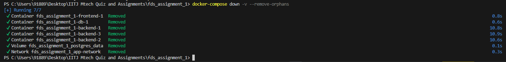

# FDS Assignment 1

## Problem Statement

Set up a multi-container distributed web application using
Docker consisting of:

- A web front-end (e.g., Nginx or Apache).
- A back-end service (e.g., Python/Node.js microservice).
- A database (e.g., MySQL/PostgreSQL).

1.  Create separate Dockerfiles for each component (front-end, back-end, and database).
    Ensure proper environment variable configuration (e.g., database credentials).
2.  Write a docker-compose.yml to orchestrate the three containers so they can communicate
    with one another (e.g., linking the back-end service to the database, exposing
    required ports).
3.  Demonstrate how you would scale the back-end service container (e.g., running
    multiple replicas). \* Test the setup by sending requests to the load-balanced back-end through the
    front-end container.
4.  Provide a short report (about 1 page) describing your Docker setup, including:
    - Key commands used
    - Network configurations
    - How to build, start, and stop the entire application stack

###### This is a Heading h6

## Solution

- Clone this repo
- Start the app (including building all images)
  `docker-compose up -d --build`
  
- Scale backend using command
  `docker-compose up -d --scale backend=3`
  
- Test scaling using command
  `1..10 | ForEach-Object { Invoke-WebRequest -Uri http://localhost/api/data -UseBasicParsing | Select-Object Content }` or command `for i in {1..10}; do curl -s http://localhost/api/data; echo ""; done` in Powershell or shell respectively.
  
- Look at logs `docker-compose logs backend | grep "GET /api/data"` and uderstand which containers server which request. Observer multiple containers like backend-1, backend-2, etc
- Cleanup using command `docker-compose down -v --remove-orphans`
  
- For deep clean in case this is not supposed to be run anymore on the system, use command `docker image prune -f`

## Architecture Overview

#### Multi-Container Setup:

- Frontend: Nginx serves static content and acts as a reverse proxy/load balancer for backend services.
- Backend: Python Flask microservice handles API requests and interacts with the database.
- Database: PostgreSQL for persistent data storage (rides, access logs, etc.).

#### Orchestration:

Managed via docker-compose.yml for seamless deployment.
Containers communicate over a custom bridge network (app-network).

## Key Features

#### Scalability:

- Backend services can be scaled horizontally using docker-compose --scale backend=N.
- Nginx load-balances traffic across backend replicas (round-robin by default).

#### Service Discovery:

- Containers resolve each other by service name (e.g., backend:5000, db:5432) via Docker’s internal DNS.

#### Environment Variables:

- Database credentials (host, port, user, password) injected via environment variables for security and flexibility.

#### Data Persistence:

- PostgreSQL data stored in a Docker volume (postgres_data) to survive container restarts.

#### Fault Tolerance:

- Stateless backend replicas ensure high availability.
- Database volume prevents data loss on container crashes.
